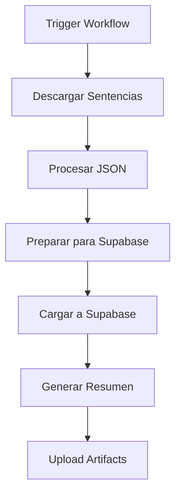

# 🚀 Integración con Supabase

Este documento explica cómo configurar la carga automática de sentencias a Supabase usando GitHub Actions.

## 📋 Requisitos

### 1. **Cuenta de Supabase**
- Proyecto creado en [supabase.com](https://supabase.com)
- URL del proyecto (ej: `https://abcdefghijklmnop.supabase.co`)
- Anon key del proyecto

### 2. **Configuración de GitHub**
- Secrets configurados en el repositorio
- Permisos de Actions habilitados

## 🔧 Configuración Paso a Paso

### **Paso 1: Configurar Supabase**

1. **Crear tabla en Supabase:**
```sql
CREATE TABLE sentencias (
    id SERIAL PRIMARY KEY,
    tribunal_origen TEXT,
    fecha_sentencia DATE,
    numero_rol TEXT,
    materia TEXT,
    texto_sentencia TEXT,
    fecha_descarga TIMESTAMP DEFAULT NOW(),
    batch_id INTEGER,
    archivo_origen TEXT,
    created_at TIMESTAMP DEFAULT NOW()
);

-- Crear índices para mejor rendimiento
CREATE INDEX idx_sentencias_tribunal ON sentencias(tribunal_origen);
CREATE INDEX idx_sentencias_fecha ON sentencias(fecha_sentencia);
CREATE INDEX idx_sentencias_rol ON sentencias(numero_rol);
```

2. **Obtener credenciales:**
   - Ve a Supabase Dashboard → Settings → API
   - Copia la **Project URL** y **anon public** key

### **Paso 2: Configurar GitHub Secrets**

1. Ve a tu repositorio en GitHub
2. **Settings** → **Secrets and variables** → **Actions**
3. Click **"New repository secret"**
4. Agrega estos secrets:

| Secret | Valor | Ejemplo |
|--------|-------|---------|
| `SUPABASE_URL` | URL de tu proyecto | `https://abcdefghijklmnop.supabase.co` |
| `SUPABASE_ANON_KEY` | Anon key de tu proyecto | `eyJhbGciOiJIUzI1NiIsInR5cCI6IkpXVCJ9...` |

### **Paso 3: Usar el Workflow**

1. Ve a **Actions** en tu repositorio
2. Selecciona **"Descargar y Cargar a Supabase"**
3. Click **"Run workflow"**
4. Configura:
   - **Fecha:** Fecha a descargar (YYYY-MM-DD)
   - **Cargar a Supabase:** ✅ Marcado para carga automática

## 🚀 Flujo Automático



### **Lo que hace el workflow:**

1. **📥 Descarga** sentencias del día especificado
2. **🔄 Procesa** los archivos JSON para Supabase
3. **🚀 Carga** automáticamente a tu base de datos
4. **📊 Genera** estadísticas y resumen
5. **📦 Guarda** artifacts para revisión

## 📊 Estructura de Datos

### **Tabla: `sentencias`**

| Campo | Tipo | Descripción |
|-------|------|-------------|
| `id` | SERIAL | ID único auto-incremental |
| `tribunal_origen` | TEXT | Tribunal que emitió la sentencia |
| `fecha_sentencia` | DATE | Fecha de la sentencia |
| `numero_rol` | TEXT | Número de rol del caso |
| `materia` | TEXT | Materia legal |
| `texto_sentencia` | TEXT | Contenido completo de la sentencia |
| `fecha_descarga` | TIMESTAMP | Cuándo se descargó |
| `batch_id` | INTEGER | ID del lote de descarga |
| `archivo_origen` | TEXT | Archivo original |
| `created_at` | TIMESTAMP | Fecha de creación en BD |

## 🔍 Verificación

### **Verificar configuración:**
```bash
python3 configurar_supabase.py --verificar
```

### **Probar carga manual:**
```bash
python3 cargar_a_supabase.py archivo.json SUPABASE_URL SUPABASE_KEY
```

## 📈 Monitoreo

### **En Supabase Dashboard:**
- Ve a **Table Editor** → **sentencias**
- Revisa los datos cargados
- Usa **SQL Editor** para consultas

### **En GitHub Actions:**
- Ve a **Actions** → **Descargar y Cargar a Supabase**
- Revisa los logs de ejecución
- Descarga artifacts si es necesario

## 🛠️ Solución de Problemas

### **Error: "Variables de Supabase no configuradas"**
- Verifica que los secrets estén configurados
- Revisa que los nombres sean exactos: `SUPABASE_URL` y `SUPABASE_ANON_KEY`

### **Error: "Conexión a Supabase fallida"**
- Verifica que la URL sea correcta
- Confirma que el anon key sea válido
- Revisa que el proyecto esté activo

### **Error: "Tabla no encontrada"**
- Ejecuta el SQL de creación de tabla
- Verifica que la tabla se llame `sentencias`
- Confirma permisos de la anon key

## 📞 Soporte

Si tienes problemas:
1. Revisa los logs del workflow
2. Verifica la configuración de Supabase
3. Confirma que los secrets estén correctos
4. Revisa que la tabla exista y tenga los permisos correctos

---

**¡Listo!** 🎉 Con esta configuración tendrás carga automática de sentencias a Supabase cada vez que ejecutes el workflow.
